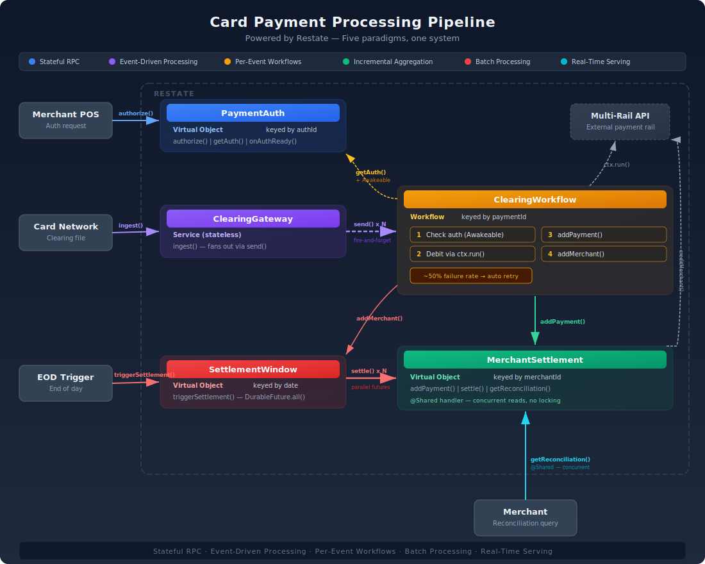

# Card Payment Processing Pipeline — Powered by Restate

An end-to-end card payment processing pipeline running entirely in [Restate](https://restate.dev). The demo models a real-world payment lifecycle:

1. **Synchronous authorization** — merchants submit auth requests as stateful RPCs
2. **Clearing file processing** — a batch file is fanned out into parallel workflow invocations
3. **Per-merchant accumulation** — payments flow into merchant settlement objects throughout the day
4. **End-of-day settlement** — batch fan-out settles all merchants in parallel, calculating fees and crediting accounts
5. **Real-time serving layer** — merchants query their current reconciliation status at any time via shared handlers

Five paradigms — stateful RPC, event-driven processing, per-event workflows, batch processing, and real-time serving — unified in one system, one deployment, one programming model.



## How It Works

A card payment moves through several stages over the course of a day. This pipeline models all of them.

**Authorization.** When a cardholder swipes their card, the merchant's payment processor sends an authorization request. In Restate, each authorization is a Virtual Object keyed by `authId` — a stateful RPC. The `PaymentAuth` handler validates the request (checks amount limits, fraud rules), stores the authorization result as durable state, and returns an approval or decline. Because Virtual Objects provide exclusive access per key, there's no risk of concurrent mutations to the same authorization.

**Clearing.** Later in the day, the card network delivers a clearing file — a batch of transactions that need to be processed and settled. The `ClearingGateway` receives the file and fans out each clearing event as a separate workflow invocation using Restate's `send()` — fire-and-forget into Restate's durable log. The gateway returns immediately; the individual events are processed in parallel without blocking the caller. This is where batch becomes event-driven processing.

**Per-payment workflow.** Each `ClearingWorkflow` is a durable workflow keyed by `paymentId`. It orchestrates the full processing of a single payment: first it checks the authorization by calling back to `PaymentAuth`, then it debits the cardholder through a multi-rail payment API (modeled as a durable side effect with automatic retries), and finally it adds the processed payment to the merchant's running tally in `MerchantSettlement` and registers the merchant in today's `SettlementWindow`. If the authorization doesn't exist yet — because clearing arrived before the auth — the workflow creates an Awakeable and suspends. It consumes no resources while waiting. When `authorize()` eventually runs, it resolves the Awakeable and the workflow picks up exactly where it left off.

**Settlement.** At end of day, `SettlementWindow` triggers batch settlement. It reads the set of merchants that accumulated payments during the day and fans out `settle()` calls to all of them as parallel durable futures using `DurableFuture.all()`. Each merchant's settlement calculates fees (2.1% discount rate + $0.10 per transaction), credits the merchant via the multi-rail API, and records the settlement. All of this happens in parallel with full error visibility — if any merchant's settlement fails, the caller knows.

**Reconciliation.** At any point — before, during, or after settlement — a merchant can query their current status. `MerchantSettlement.getReconciliation()` is a `@Shared` handler, meaning it runs concurrently with no locking. It reads the current durable state and returns a reconciliation report showing unsettled payments, settled payments, and settlement records. This is a real-time serving layer built directly on top of the same state that the processing pipeline writes to — no separate database, no replication lag.

## Architecture

| Component | Restate Primitive | Key | Paradigm |
|---|---|---|---|
| PaymentAuth | Virtual Object | authId | Stateful RPC |
| ClearingGateway | Service (stateless) | — | Event-driven, parallel, processing |
| ClearingWorkflow | Workflow | paymentId | Durable workflow |
| MerchantSettlement | Virtual Object | merchantId | Incremental aggregation + batch |
| SettlementWindow | Virtual Object | date string | Batch fan-out trigger |

### Flow

```
Auth Request ──► PaymentAuth[authId].authorize()       (stateful RPC)
                         │
Clearing File ──► ClearingGateway.ingest()              (event-driven, parallel, processing via send())
                         │
                  ClearingWorkflow[paymentId].run()      (durable workflow)
                    ├── getAuth() ← PaymentAuth
                    ├── debitCardholder() ← MultiRail API (ctx.run, ~50% failure)
                    ├── addPayment() → MerchantSettlement
                    └── addMerchant() → SettlementWindow
                         │
Trigger ──────► SettlementWindow[date].triggerSettlement() (batch fan-out)
                    └── settle() → MerchantSettlement[]   (parallel futures)
                         │
Query ────────► MerchantSettlement[id].getReconciliation() (shared handler)
```

## Prerequisites

- Java 21+
- Docker (for Restate server)

## Quick Start

```bash
# Terminal 1 — build, start Restate, start the app
./scripts/start.sh

# Terminal 2 — register and run the demo
./scripts/register.sh
./scripts/demo.sh
```

## Demo Scripts

| Script | Purpose |
|---|---|
| `scripts/start.sh` | Build, start Restate, start the app |
| `scripts/register.sh` | Register deployment with Restate |
| `scripts/create-auth.sh <authId> <merchantId> <amount>` | Create auth + append clearing event |
| `scripts/send-clearing-file.sh` | Send accumulated clearing file |
| `scripts/trigger-settlement.sh [date]` | Trigger batch settlement |
| `scripts/query-recon.sh <merchantId>` | Query reconciliation report |
| `scripts/reset.sh` | Reset clearing file for fresh run |
| `scripts/demo.sh` | Full guided walkthrough |

## Key Demo Moments

**Idempotency** — Re-send the same clearing file. Workflows are keyed by paymentId, so Restate won't re-execute them. Exactly-once processing with zero extra code.

**Late authorization** — Send a clearing event before its authorization exists. The workflow creates an Awakeable and suspends. When `authorize()` runs, it resolves the Awakeable and the workflow completes instantly. No polling, no retry loops.

**Transient failures** — The multi-rail API has a ~50% failure rate. Restate durably retries side effects automatically. Watch the app logs to see failures followed by successful retries.
